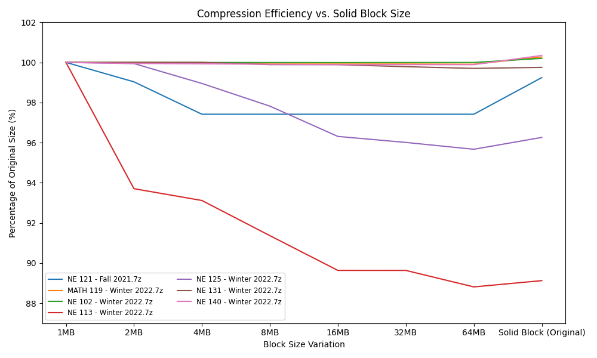

# Nano Technology Engineering Class Backup Website
A Website for Hosting and Sharing the LEARN Class Content Backups and Class Software for the Nano Technology Engineering Cohort of 2021-2026.

As of June of 2025, the Univeristy of Waterloo is reducing every Students One Drive Cloud Storage from 5 TB to 25 GB. This reduction makes it difficult to share the Class Backup files in an efficient manner. In this current day, the Class Backups are around 45 GB. To get around this, I have decided to Host and Share the files on a Server and serve them through a Website.

As of Dec 2025, the website has been remade as a Blazor / .NET / C# Website with better security 

As of Jan 2026, the website now uses a Postgres SQL Backend and allows complete visibility and download of all files. Even when hidden behind compressed .7z files.

# Access
Website can be accessed through any Browser and through any Device if wanted through the following link [Nano-Backup-Website](https://135.23.125.170:9000/).
This Website is currently being hosted on a dedicated Mini PC in Waterloo.

# Release Versions
## Current Website Version
v1.0.4 - Jan 20 2026

## Versions
v0.1.3 - May 22 2025 - Added Organized Version of NE 336. Missing Files were added and Course Organized. Removed some overprotective rules 

v0.1.4 - Jun 03 2025 - Added Raspberry Pi 4 Docker Build Support 

v0.1.5 - Jun 03 2025 - Made Table Text Larger, Added Alert Popup for Files Larger than 1 GB. It will warn that files may take more than 1 Min to start Downloading, Moving Webiste to Raspberry Pi for the Week 

v0.1.6 - Sep 07 2025 - Removed the outdated Raspberry Pi 4 Message, Moved website hosting to Waterloo apartment on a dedicated Mini PC

v0.1.7 - Oct 20 2025 - Added 1A Folder with NE 121 Assessments with Answers, added What's App number for Class Contributions

v0.1.8 - Nov 11 2025 - Added Software Folder with a few Windows Softwares that are used in Class

v0.2.0 - Dec 28 2025 - Improved Website by remaking it in Blazor/DotNet/C# Increasing Reliability and Download Speed

v0.2.1 - Dec 30 2025 - Substantially Reduced the size of the Docker Container hosting the website

v1.0.0 - Jan 18 2026 - Upgraded Backend to use Postgres SQL, Added Better File Visibility and Download Capabilities

v1.0.1 - Jan 18 2026 - Added Garbage Collection ability to reduce Server Memory Usage

v1.0.2 - Jan 18 2026 - Found a way to bypass MemoryStream

v1.0.3 - Jan 19 2026 - Further Garbage Collection Improvements and Server Memory Usage Reduction

v1.0.4 - Jan 20 2026 - Decompressed and Recompressed Database into new Optimized format. Ensured instant Downloads on all Files Occur.

# Research
After introducing the .7z and SQL Update to the Website I noticed that for retrieving files in larger compressed files it took exponentially longer, so I investigated witt the compression technology on a subsection of files to optimize for both size and Decompression / Serving Efficiency.

I found that that the Sweetspot for sizes and Serving Speed lied at 32 MB or 64 MB as shown in the graph below. This optimization has turned waiting for a 1 minute for certain files to start downloading, to instant downloads on any file!

# Contact
For Additional Support, Contact MrDNAlex through the following email : ``Mr.DNAlex.2003@gmail.com``.
